# Solar System

The Solar System in Common Lisp on iOS: the Sun, the planets, the dwarf
planets, the major moons, comets and the asteroid belt. Everything is where it
really is, at any date from 3000 BC to 3000 AD. You can see it in 3D from
outside or from the Earth, and point the phone at the real sky. It uses ECL
through [asdf-ios-app](../asdf-ios-app), with UIKit and Metal reached through
[objc](../objc).

<table>
<tr>
  <td width="33%">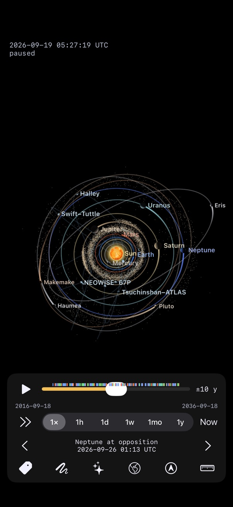<br><sub>Now: planets, dwarf planets, comets and the asteroid belt; ticks along the scrubber mark the events of the next and last ten years.</sub></td>
  <td width="33%">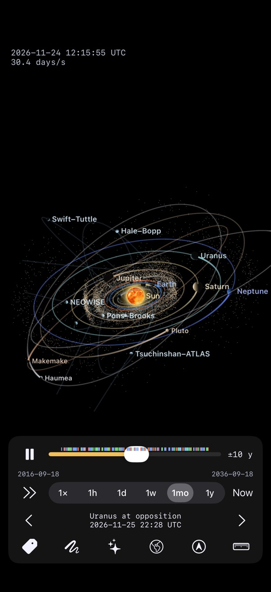<br><sub>At a month a second, tilted, each body leaving a fading trail.</sub></td>
  <td width="33%">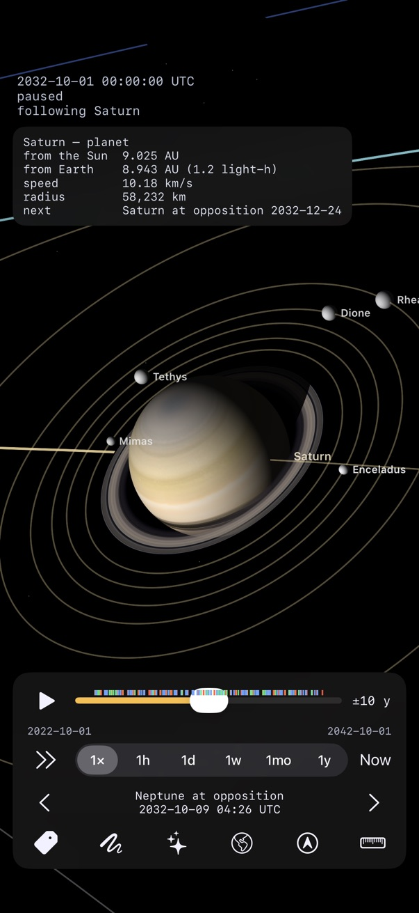<br><sub>Saturn in 2032, its rings open, its shadow across them, five of its moons, and its card.</sub></td>
</tr>
<tr>
  <td width="33%">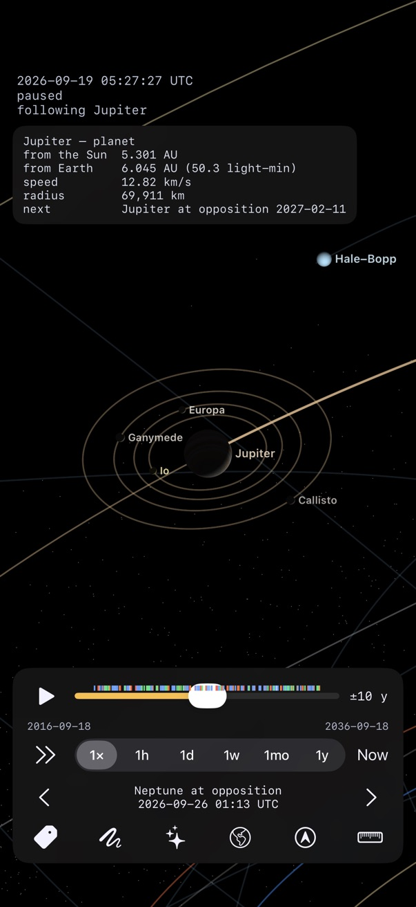<br><sub>Jupiter and the Galilean moons, followed: 50 light-minutes away, at opposition next February.</sub></td>
  <td width="33%">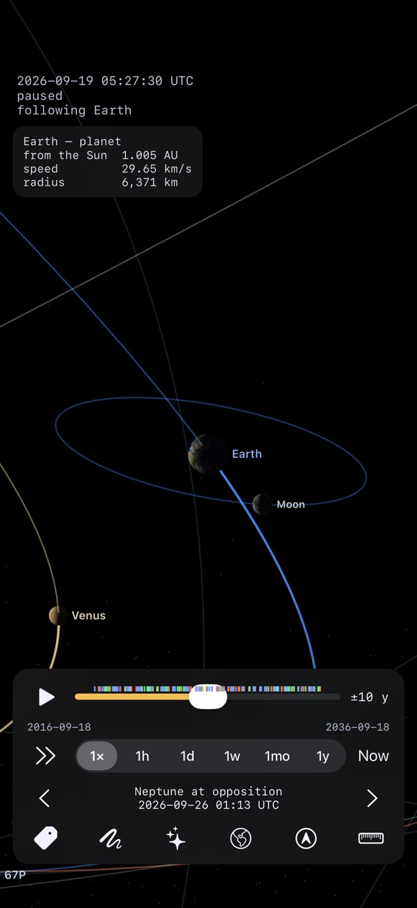<br><sub>The Earth and the Moon, Venus beyond.</sub></td>
  <td width="33%">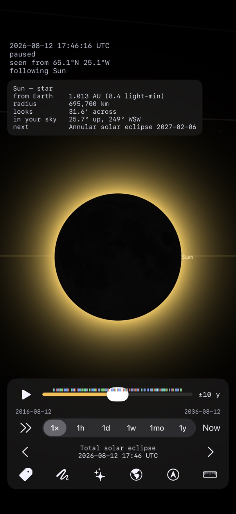<br><sub>The total solar eclipse of 12 August 2026, from its point of greatest eclipse, 65.1°N 25.1°W.</sub></td>
</tr>
<tr>
  <td width="33%">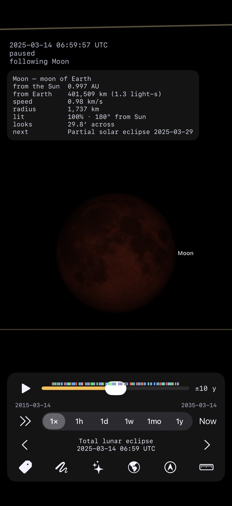<br><sub>The total lunar eclipse of 14 March 2025: the Moon in the Earth's umbra.</sub></td>
  <td width="33%">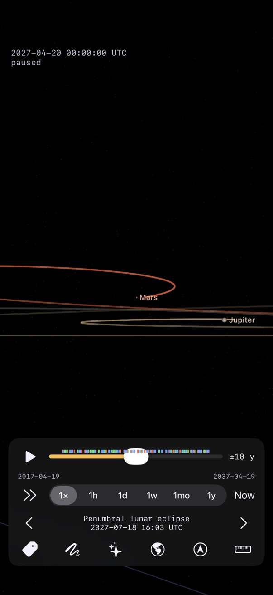<br><sub>Mars's retrograde loop in 2027 from the Earth, the path of its past year, Jupiter's below.</sub></td>
  <td width="33%">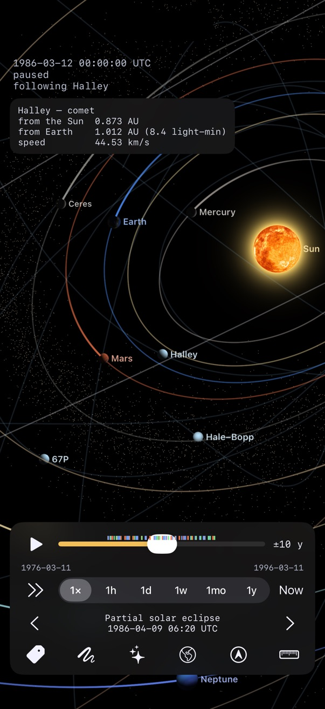<br><sub>Halley's comet at its 1986 perihelion, among the inner planets.</sub></td>
</tr>
<tr>
  <td width="33%">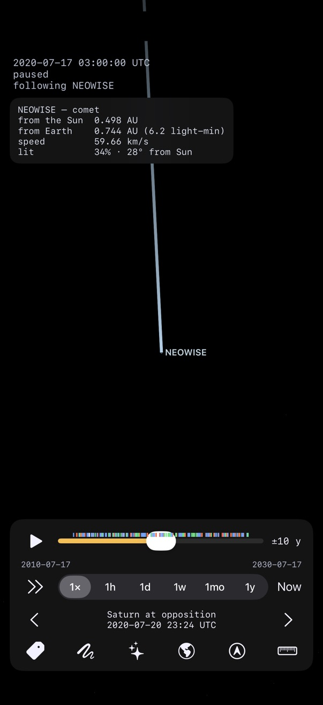<br><sub>Comet NEOWISE from the Earth in July 2020, its tail away from the Sun.</sub></td>
  <td width="33%">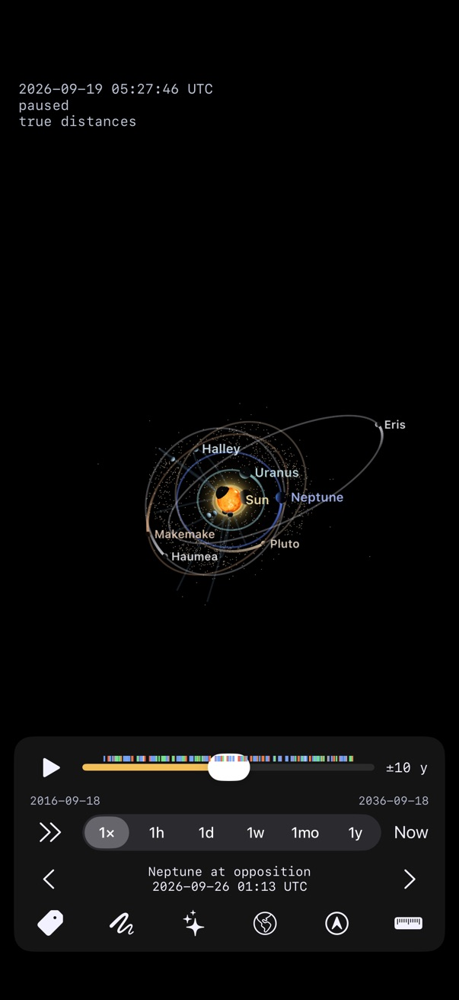<br><sub>The same solar system at true distances: the inner planets vanish into the Sun's glow.</sub></td>
  <td width="33%">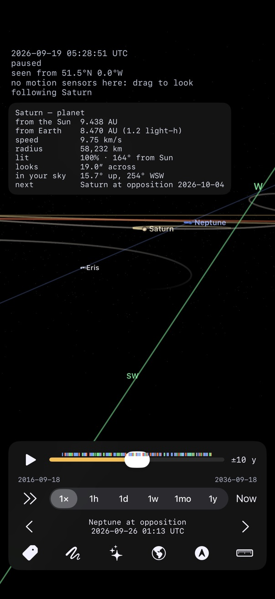<br><sub>Pointing the phone from Greenwich: a horizon, the compass, and where Saturn is in the sky.</sub></td>
</tr>
</table>

These are simulator screenshots, staged from a REPL connected to the app
(built with `SOLAR_REPL=1`).

- **Positions** come from E. M. Standish's Keplerian elements (JPL): table 1
  inside 1800–2050 and tables 2a/2b outside it, with Kepler's equation solved
  for every planet on every frame. Nothing is integrated, so any date costs the
  same. They are checked against JPL Horizons at five epochs from 1600 to 2400:
  within 0.1° for all but Saturn, which is within 0.15° (a known limit of mean
  elements).
- **Dwarf planets**: Pluto, Ceres, Eris, Haumea and Makemake. JPL
  Horizons' osculating elements are sampled every 10 years from 1600 to 2500,
  and a position is propagated from the samples on either side and blended.
  All are within 0.01° of Horizons except Ceres (0.4°, pulled by Jupiter).
- **Moons**: the Moon comes from Meeus's ELP-2000 series (within 0.01°). Twenty
  more moons of Mars, Jupiter, Saturn, Uranus, Neptune and Pluto use elements
  that `tools/fit-moons.py` fits to Horizons, including the resonance swing of
  Mimas and Tethys. Over 1850–2150 each is within a degree, except Mimas
  (4.6°) and Triton (2.8°).
- **Rotation**: each body turns according to the IAU's pole directions and
  rotation angles. Earth turns once a sidereal day with the correct side in
  daylight, Uranus rolls on its side, and Venus turns backwards. The Sun, the
  planets and the Moon are textured from Solar System Scope's maps
  (solarsystemscope.com/textures, CC BY 4.0). The dwarf planets are left
  untextured because their published maps are invented. Saturn's rings sit in
  its equatorial plane. Saturn's shadow falls across the rings, and the rings'
  shadow falls on Saturn, with gaps like the Cassini Division letting light
  through. Uranus's ten main rings are drawn at their true radii from Voyager
  2, in the same plane as its moons' orbits.
- **Comets and the asteroid belt**: nine comets, including Halley, Hale–Bopp,
  NEOWISE and Tsuchinshan–ATLAS (on a hyperbola), use JPL Horizons' elements
  for the perihelion each is known for. They match Horizons to within half a
  degree around those dates. Tails point away from the Sun and grow as a
  comet nears it. The belt is 8,825 asteroids brighter than magnitude 13 from
  JPL's Small-Body Database, each placed by Kepler's equation on the GPU. The
  Kirkwood gaps, where Jupiter has cleared the belt, show up without any
  special code.
- **Events**: solar and lunar eclipses, transits of Mercury and Venus,
  oppositions, and conjunctions closer than 0.5° are found in the same
  ephemeris by a background search. They're tested against NASA's eclipse canon
  for 2017–2028, with greatest eclipse times within three minutes.
- **Screen**: each body's direction from the Sun is exact. Distance is
  compressed as r^0.4 (`*radius-exponent*`; 1 is linear) so that Neptune and
  Eris fit on one screen. Each planet's moons are magnified around it on a
  scale of their own, so they fade in as you zoom towards the planet. Disc
  sizes are exaggerated, and each disc is lit on the side facing the Sun.
- **3D**: the scene is a real 3D model (planets' inclinations included), seen
  through a perspective camera. Orbits and discs are drawn in pixels after
  projection, so they stay crisp at any zoom, and each planet shows the phase
  it has from where you are looking.
- **Time** runs at real time by default. It stops at the ends of the
  ephemeris, 3000 BC and 3000 AD.

## Controls

| Gesture | Does |
|---|---|
| one-finger drag | turn the scene about the screen's x and y axes |
| two-finger twist | turn it about the axis out of the screen |
| pinch | zoom |
| two-finger drag | pan |
| tap a body | follow it; for a planet with moons, zoom in until its moons show |
| double tap | back to the view from above the north pole, following nothing |
| tap empty space | hide or show the controls |
| tap the clock | the credits: whose numbers and whose pictures these are |

The bottom row of toggles:
- **tag**: name labels.
- **scribble**: trails. Each body gets a fading trail over the last eighth of
  its orbit, or over the past year in the Earth view.
- **sparkles**: comets and asteroids.
- **globe**: the view from Earth. See below.
- **ruler**: true distances.

## The view from Earth

The camera sits at Earth's centre, and everything is where it really is.
Planets show their phases, and the Moon passes in front of the Sun. Pinch to
narrow the view, from 120° down to 0.03°: Jupiter becomes a disc with its moons
beside it. The ecliptic and the celestial equator run across the sky, and the
trails trace each planet's path over the past year, including Mars's
retrograde loops.

Stepping to an eclipse in this view looks at it. A lunar eclipse shows the
Moon turning red in Earth's shadow. A solar eclipse moves you to the point on
Earth where it is greatest, matching NASA's published points to within a
degree, and keeps you there as Earth turns.

Tap any body to follow it, and a card under the clock shows its distances from
the Sun and from Earth, how long its light takes to reach us, its speed and
size, and the next event it takes part in. In the Earth view the card also
shows how much of it is lit, its angle from the Sun and its apparent size.

The location button (in the Earth view) puts you where the phone is and turns
the view as you hold the phone up to the sky, using Core Location and Core
Motion's true-north attitude. A horizon line and compass points are drawn, and
the card gives the followed body's altitude and azimuth. In the simulator,
which has no motion sensors, the location is still used and you drag to look
around.

The app remembers where it was left: the date (or now, if it was left at real
time), the speed, the toggles, the camera and what it was following.

The panel at the bottom works like a video player:
- ⏸/▶ plays and pauses.
- The scrubber covers a window of time around the current date; the window
  moves along when the date runs off either end.
- **±10 y** cycles the window's width: 1, 10, 100 or 1000 years each way.
- ⏩/⏪ sets the direction of play.
- The speed selector sets how much simulated time passes per real second:
  real time, an hour, a day, a week, a month or a year.
- **Now** returns to the present in real time.
- The bottom row has the tag button (show or hide name labels), **‹ ›** to
  step to the previous or next event (an eclipse also follows Earth), the
  name of the event in view (tap it to go there), and the ruler, which eases
  the view to true distances and back.

Coloured ticks along the scrubber mark events: gold for solar eclipses, red
for lunar eclipses, white for transits, blue for oppositions, and green for
conjunctions.

## The icon

```
swift tools/make-icon.swift     # rewrites res/Icon.xcassets/AppIcon.appiconset/icon-1024.png
```

The icon is drawn with CoreGraphics in the app's own colours. The build
compiles `res/Icon.xcassets` with `actool` (`:bundle-icon`).

## Refitting the moons

```
python3 tools/fit-moons.py      # needs numpy; rewrites src/moon-elements.lisp
```

The Horizons states are cached in `tools/moon-states.json`; delete that
file to fetch them again.

## Test the physics (no simulator)

```
sbcl --eval '(asdf:test-system "solar-system-core")' --quit
```

## Build and run

```
export ECL_IOS_PREFIX=~/Projects/ecl/ecl-iOS/ \
       ECL_IOS_SIM_PREFIX=~/Projects/ecl/ecl-iOS-sim/ \
       ECL_HOST=~/Projects/ecl/ecl-native/bin/ecl
$ECL_HOST --eval '(require :asdf)' --eval '(asdf:make "solar-system")' --eval '(ext:quit)'
xcrun simctl install booted build/iphonesimulator/Solar.app
xcrun simctl launch --console-pty booted org.asdf-ios-app.solar-system
```

To start the clock fast, for example at a million times real time (Mercury
laps in about 8 s):

```
xcrun simctl launch booted org.asdf-ios-app.solar-system -SolarTimeScale 1000000
```

Build with `SOLAR_REPL=1` to include slynk on port 4005. Slynk must be on the
source registry. Then, from SLY:

```lisp
(solar-system:set-time-scale 86400)                          ; a day a second
(solar-system:set-sim-date (solar-system:jd-from-calendar 1969 7 20))
(setf solar-system:*radius-exponent* 1d0)                    ; true scale
(solar-system:now)
```

If drawing ever signals an error, the view pauses and the clock label shows
the error. Fix it over the REPL, then call `(solar-system:resume)`.

## TestFlight

```
tools/testflight.sh                 # build, validate, upload
```

with a distribution identity, an App Store profile and an App Store Connect
API key in the environment. [doc/testflight.md](doc/testflight.md) says where
those come from and what App Store Connect wants once the build is up.
